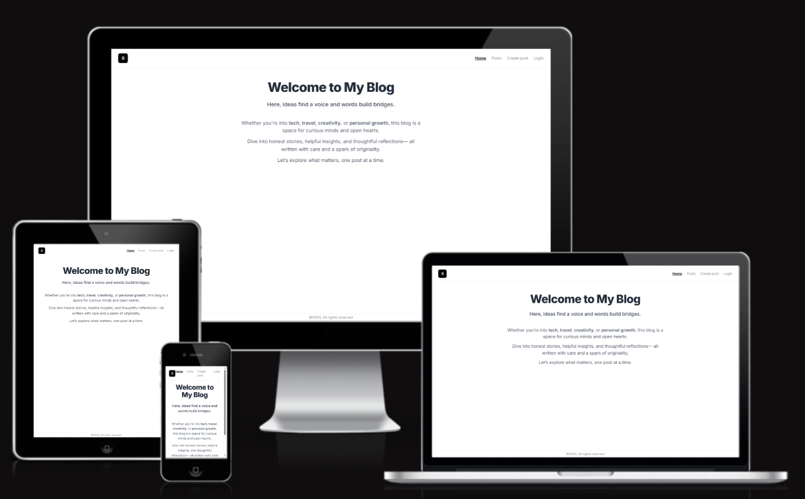

# Next.js Blog App

This is a small full-stack blog project built with **Next.js 14 App Router**, **Prisma**, and **Kinde Auth**.  
The goal of this project was to **practice conditional rendering,  server actions, and authentication ** with **Kinde**.



My Github Repo could be find [here] (https://github.com/aimansae/next-js-kinde)

An this is the link to the live [site](https://next-js-kinde.vercel.app/)

## Table of Contents

- [Features](#features)
- [Learning Goals](#learning-goals)
- [Challenges](#challenges)
- [Technologies Used](#technologies-used)
- [Getting Started](#getting-started)
- [Future Features](#future-features)
- [Credits](#credits)

## Features

- Authentication with [Kinde](https://kinde.com)
- Conditional rendering based on user login state
- Create, edit, and delete blog posts through database
- Auth-protected routes for post creation and deletion
- Built using **Server Actions** (Next.js 14)
- Simple upvote button (disabled for authors)
- Tailwind CSS for styling

## Learning Goals

- Practice **conditional UI rendering**
- Understand **authentication** flow with Kinde
- Implement **server actions** in Next.js
- Work with **relational data** using Prisma
- Improve UX with real-time UI updates


## Technologies used

- Next.js [App Router](https://nextjs.org/docs/app)
- [Prisma + PostgreSQL](https://www.prisma.io/nextjs) 
- Kinde Auth (OAuth authentication)
- [Tailwind CSS](https://tailwindcss.com/docs/installation/framework-guides/nextjs)
- [TypeScript](https://nextjs.org/docs/pages/api-reference/config/typescript)


## Challenges

This project pushed me to think more deeply about full-stack development than I initially expected. A huge thanks to BiteGrad! Here's how I approached and overcame the key technical challenges:

1. Setting Up Prisma with PostgreSQL
The first hurdle was setting up Prisma with PostgreSQL. I needed to:

- Define the User and Post models
- Connect to the database (locally or remotely)
- Use prisma db push and prisma generate correctly to sync the schema and generate the client
- Once I grasped how Prisma handles relationships and migrations, things became much smoother.

```bash
model Post {
  id        String   @id @default(cuid())
  title     String
  body   String
  authorId  String
  author    User     @relation(fields: [authorId], references: [id])
  createdAt DateTime @default(now())
}
```
2. Authentication with Kinde
Integrating Kinde Auth was the next major step. Since the tutorial used Server Actions to handle form submissions, I needed to:

- Check if a user was authenticated on both the client and server
- Retrieve the current user session using Kinde’s helpers
- Gracefully handle unauthenticated states by showing error messages or redirecting to the login page
- This required me to understand authentication flow across both environments and ensure secure access control.

3. Creating Posts with Server Actions
Instead of using traditional API routes, I implemented Server Actions to create new posts directly from the form.

```bash
export async function createPost(formData: FormData) {
  const user = await getKindeServerSession().getUser();
  if (!user) throw new Error("Not authenticated");

  const title = formData.get("title") as string;
  const content = formData.get("body") as string;

  await prisma.post.create({
    data: {
      title,
      content,
      authorId: user.id,
    },
  });
}
```
This forced me to think carefully about where to place logic (server vs. client) and how to enforce authentication securely on the backend.

4. Delete Functionality and Authorization
Building the delete functionality involved more than just removing data. I had to consider:

- Authorization: Only allow post deletion by the user who created it
- Conditional UI: Show edit/delete buttons only if the logged-in user is the author
- User feedback: Show an error if an unauthorized user attempts deletion
- I created a secure API route to handle deletion, and added checks.
```bash
if (!post || post.authorId !== user.id) {
    throw new Error("You cannot delete this post");
  }
```
5. Conditional Rendering & Permissions
Another key part was designing the UI to behave appropriately based on authentication and ownership:

- Unauthenticated users are prompted to log in instead of being shown the post editor

- Authors cannot upvote their own content the button is not shown for them

This added to the overall logic and UX depth of the app.

6. Loading States with React Suspense
To improve the user experience while waiting for data, I implemented React Suspense to show a loader while the server fetched a post:

```bash
<Suspense fallback={<Loading />}>
  <PostsList />
</Suspense>

```
This helped deliver a smoother, more responsive feel to the application.

## My Thought Process
Throughout this project, I had to approach each feature both logically and strategically:

- I learned to think about how data flows between client and server, and how to securely bridge that connection.

- I paid special attention to separating frontend logic (rendering UI) from backend logic (validation, DB access).

- I constantly asked: “Is this user allowed to do this?” to ensure correct permission handling.

- I focused on building a UI that adapts based on user status — whether logged in, logged out, or unauthorized.

I treated authentication, authorization, error handling, and feedback as critical parts of the user experience.

- This was not just about coding features — it was about learning how to build a secure, full-stack product that behaves responsibly for every type of user.


## Getting Started

```bash
git clone https://github.com/yourusername/blog-app.git
cd blog-app
npm install
npx prisma generate
npx prisma db push
npm run dev
```
## Future Features

- Display `createdAt` and `updatedAt` timestamps for posts
- Improved and responsive UI for mobile/desktop
- Share post functionality (e.g., social links or copy URL)
- Comment system
- Post search and filtering
- Better ui for authenticated users 
- Tests with Jest


## Credits

Special thanks to [Youtube Video (BiteGrad)](https://www.youtube.com/watch?v=vwSlYG7hFk0) for the helpful content and opportunity to code along.

